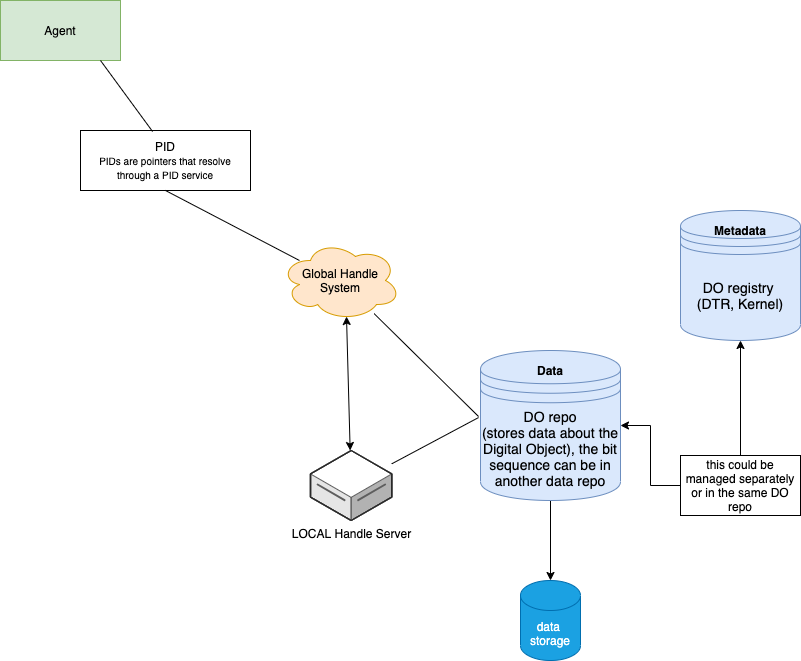

### Example workflow involving PID, PIT, DTR

With [openDS basic structure](https://github.com/hardistyar/openDS-schemas/blob/main/basic-structure.md) and digital specimen in mind. 

1. Agent (human or machine) encounters a FAIR Digital Object (FDO): 
[20.5000.1025/64ae0cf0dacb7bd20ba5](hdl.handle.net/http://hdl.handle.net/api/handles/20.5000.1025/64ae0cf0dacb7bd20ba5) 

(these PIDs could be present in publications, specimen refinery pipeline or a data aggregator landing page) 

2. Agent sends the PID to a PID service (Global DOI/Handle system with local resolvers, backups, mirrors)

http://hdl.handle.net/api/handles/20.5000.1025/64ae0cf0dacb7bd20ba5

**NOTE** We need to pay attention here which interface the agent will query. In this example, the Global Handle Server (GHS)
only returns 10320/loc and 0.TYPE/DOIPService, the typeName should be exposed here. 

Here is a a PID example from the CIMP6 datasets that exposes more elements to the GHS: 
http://hdl.handle.net/api/handles/21.14100/1d777d08-6ffe-3a8e-a191-bd01476b5345

Even though this is not using Type, it returns elements such as AGGREGATION_LEVEL, HAS_PARTS, VERSION_NUMBER, HOSTING_NODE, REPLICA_NODE that provide important context for the digital object. 

3. PID Service returns the PID Kernel Infomration (KI) to the Agent. 

**NOTE** We need to decide what this KI entails. Also depends on what the GHS stores. 

4. Agent parses KI. 

5. Agent decides what to do with the FDO (using DOIP/REST or both?). Here the FDO repository comes into the play. For us this is Cordra (nsidr.org). 

6. Agent decides what extra information is needed for the operation. 

7. There are other extra information ("metdata") that the Agent can access which might not be available in step 2, 3,4. 

Such as type information. 

**NOTE** should this be done on step 3 or 4? 

is the communication now happening between agent and cordra? Or cordra and Handle system? 
For example, Cordra can query the DTR using a PID. 21.T11148/4ac7431c2616a213481e which is a PID-BasicInfoType 
(see https://github.com/hardistyar/openDS-schemas/blob/main/pid-info-types.md) 

7. Cordra accesses the DTR for Type information 

8. DTR returns the Type to Cordra

9. Cordra returns access control (ACL) and other metadata to the Agent. Would Cordra have this ACL information? 

10. If authorized, Agent now requests the content from the data repository (REST or DOIP?). This could be in cordra or in another repo as well. 

11. Data Repository returns the requested object directly to the Agent. Is cordra not involved here anymore? 

### Further reading and other examples 

- [https://gitlab.gwdg.de/uschwar1/activities-in-a-pid-architecture](Activities in a pid architecture) by Ulrich Schwardmann (includes diagrams that show the main foreground and background activities in a PID architecture)

