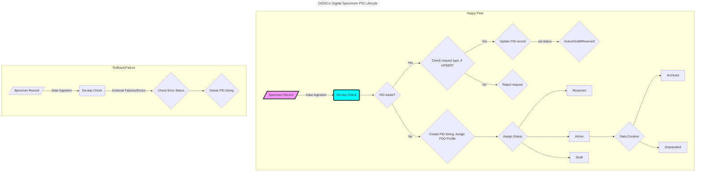

## DiSSCo Digital Specimen PID LifeCycle 

In the [BiCiKL](https://bicikl-project.eu/) [D7.1](https://doi.org/10.3897/arphapreprints.e107168
) (Architecture Design for a pan-European PID system for Digital Specimens), we proposed the following concept of PID lifecyle. This is congruent with the best practices in general scholarly communication and research output PID management areana. 

>PID lifecycles, similar to data life cycles, are important concepts to accommodate different objects and workflow processes. These life cycles will be recorded as pidStatus in the PID record (see Table 1 above). For a similar implementation, see DataCite DOI states. The lifecycle states we currently envisage are listed in Table 2.
Example PID status:

| PID Status             | Desc | Notes |
| :---------------- | :------: | ----: |
| Reserved        |  Reserved status means the PID string is generated but it does not yet resolve.    |  |
| Draft       |  Draft status means the PID record is not published and findable in the Digital Specimen repository.    |  |
| Active           | PIDs are registered and indexed in the Digital Specimen repository.   |  |

### Happy flow: 
#### New Digital Specimen creation: 

1. Specimen record is ingested. 
2. PID service is called.
3. If PID string does not exist, the string is created (this is part of the PID "minting" and "registration" process. 
4. Part of this step, also includes assigning a FDO Profile. This means FDO Record is created along with the PID. 
6. Based on the workflow, a PID status is assigned. 

#### Reserved PID 
Reserved status means that the PID is generated but it does not resolve. The use case here is a list of pregenerated IDs can be supplied to a workflow. 

minimum FDO Record for **Reserved** PID 
1. HS_ADMIN value 
2. pidIssuer 
3. pidStatus
4. reservingInstitution

Draft and Reserved PIDs are not findable. 
Draft PIDs can act as Active except differnet value for pidStatus and they are not findable. 

