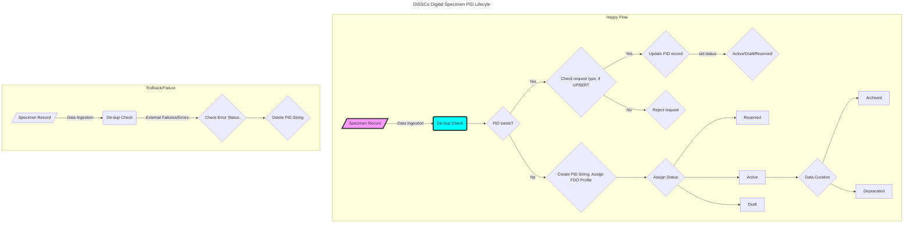

## DiSSCo Digital Specimen PID LifeCycle 

In our deliverable [D7.1](https://doi.org/10.3897/arphapreprints.e107168), part of the [BiCiKL](https://bicikl-project.eu/) project focusing on developing a pan-European PID system for Digital Specimens, we proposed a concept for managing the lifecycle of Persistent Identifiers (PIDs). This concept is in line with the best practices in scholarly communication and research output PID management.

>PID lifecycles, similar to data life cycles, are important concepts to accommodate different objects and workflow processes. These life cycles will be recorded as pidStatus in the PID record. For a similar implementation, see DataCite DOI states. Example PID status:

| PID Status             | Desc | Notes |
| :---------------- | :------: | ----: |
| Reserved        |  Reserved status means the PID string is generated but it does not yet resolve.    |  |
| Draft       |  Draft status means the PID record is not published and findable in the Digital Specimen repository.    |  |
| Active           | PIDs are registered and indexed in the Digital Specimen repository.   |  |

### Happy flow: 
#### New Digital Specimen creation: 

1. Specimen record is ingested. 
2. PID service is called.
3. If PID string does not exist, the string is created (this is part of the PID "minting" and "registration" process). 
4. Digital Specimen creation process also includes assigning a FDO Profile. This means that a FDO Record is created along with the PID string. 
6. Based on the workflow, a PID status is assigned.

#### Rollback and failure 

1. Specimen record is ingested. 
2. PID service is called.
3. If there are any errors or external failures, we check the status and delete the PID string. 

#### FDO Record 

To work with the PID during any lifecycle, we will need to register the value with the Handle system. This requires a minimal FDO Record. 

FDO Record are metadata inserted into the PID system and it represents a specific digital object using a particular FDO Profile. FDO Profiles can applied to multiple FDOs, but an FDO Record provides specific key-value pairs of attributes that show the values associated with those attributes for a particular FDO.

We need to ensure that the string is not taken to avoid duplication. 

#### Reserved PID 

Reserved status means that the PID is generated but it does not resolve. The use case here is a list of pregenerated IDs that can be supplied to a workflow. 

Minimum FDO Record for **Reserved** PID 

1. HS_ADMIN value 
2. pidIssuer 
3. pidStatus
4. reservingInstitution (new element) 

Policy: Can Reserved PIDs be deleted?  

#### Draft PID 
TODO: Minimum FDO Record for **Draft** PID 

Policy: Can Draft PIDs be deleted? 

#### Active 
 
Minimum FDO Record for **Active** PID 

fdoProfile
digitalObjectType
digitalObjectName
pid
pidIssuer
pidIssuerName
issuedForAgent
issuedForAgentName
pidRecordIssueDate
pidRecordIssueNumber
structuralType
pidStatus

Active PIDs cannot be deleted. 

#### Other statuses 

Based on specific use cases we can also have: Retired, Obsolete, Merged, Split

Data Flow diagram: 

