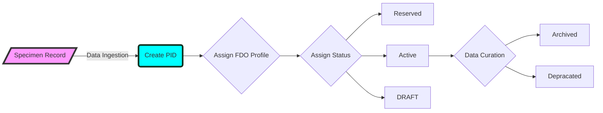

## DiSSCo Digital Specimen PID LifeCycle 

Based on BiCiKL D7.1 

>PID lifecycles, similar to data life cycles, are important concepts to accommodate different objects and workflow processes. These life cycles will be recorded as pidStatus in the PID record (see Table 1 above). For a similar implementation, see DataCite DOI states. The lifecycle states we currently envisage are listed in Table 2.

| PID State             | Desc | Notes |
| :---------------- | :------: | ----: |
| DRAFT        |  DRAFT status means the PID record is not published and findable in the Digital Specimen repository.    |  |
| ACTIVE           |   PIDs are registered in the global system and indexed in the Digital Specimen repository.   |  |

### Happy flow: 
#### New Digital Specimen: 
1. Specimen record is ingested. 
2. PID service is called
3. Based on the FDO Type and PID lifecycle status, a particular FDO Profile is chosen. This means FDO Record is created along with the PID. 
4. Based on the workflow, the status is either **ACTIVE** or **DRAFT**

#### Reserved PID 
Reserved status means that the PID is generated but it does not resolve. The use case here is a list of pregenerated IDs can be supplied to a workflow. 

minimum FDO Record for **Reserved** PID 
1. HS_ADMIN value 
2. pidIssuer 
3. pidStatus
4. reservingInstitution

DRAFT and RESERVED PIDs are not findable. 

DRAFT PIDs can be same as ACTIVE except differnet value for pidStatus and they are not findable. 

### TODO: 
1. Different FDO Record elements based on different PID status. 
2. Policy: what gets DRAFT vs ACTIVE. 

