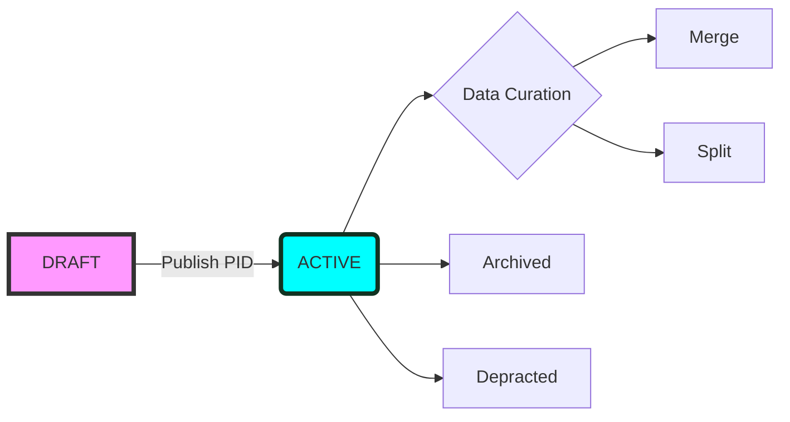

DiSSCo Digital Specimen PID LifeCycle 

From D7.1 

PID lifecycles, similar to data life cycles, are important concepts to accommodate different objects and workflow processes. These life cycles will be recorded as pidStatus in the PID record (see Table 1 above). For a similar implementation, see DataCite DOI states. The lifecycle states we currently envisage are listed in Table 2.

| PID State             | Desc | Notes |
| :---------------- | :------: | ----: |
| DRAFT        |  DRAFT status means the PID record is not published and findable in the Digital Specimen repository.    |  |
| ACTIVE           |   PIDs are registered in the global system and indexed in the Digital Specimen repository.   |  |

